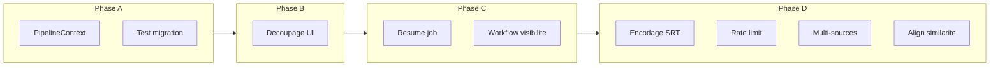

# Plan d’action — HowIMetYourCorpus

Document consolidé : état des lieux (backlog + analyse de code), ce qui est déjà réalisé, et plan priorisé pour la suite. À utiliser avec **DOC_BACKLOG.md** (détail des demandes) et **DOC_NETTOYAGE.md** (rituel de nettoyage des doc).

---

## Prochaine session

**Prochaines actions :** Évolutions mineures selon besoin.

**État :** Phase A–D et M1–M7 réalisés. P2 §6.2, §7.1, §8 réalisés. **§10** : double-clic Corpus → Inspecteur. **§11** : Normalisation des sous-titres (profil, « Normaliser la piste », option réécriture SRT). **§14** : UI workflow 3 blocs (GroupBox Corpus Bloc 1/2, tooltips onglets). **§5 (complément)** : Segmenter sélection/tout, « Tout faire (sélection) » (fetch→norm→segment→index). Refactor db terminé. Plan §14 (audit, intégrité orphelins, API batch). 61 tests verts.

**Détail :** voir §3 (Plan par phases et P0/P1/P2) et §4 (checklist).

---

## Comment utiliser ce plan

- **Avant une session** — Lire « Prochaine session » ci-dessus, choisir 1–3 actions, éventuellement cocher la checklist §4.
- **Pendant** — Travailler dans l’ordre P0 puis P1 (sauf contrainte de temps). Les phases A→B→C→D donnent l’ordre recommandé.
- **Après une session** — Mettre à jour le bloc « Prochaine session », cocher les items §4 réalisés, et si une demande du backlog est réalisée : l’ajouter au tableau §1 « Déjà réalisé », la marquer dans la section « Réalisé » de DOC_BACKLOG.md, et la retirer des tableaux « Reste à faire » et « Plan priorisé » (§2 / §3).

Le plan est révisé après chaque sprint ou mise à jour majeure du backlog.

---

## 1. Déjà réalisé (vérifié)

Les entrées suivantes du backlog sont **implémentées** ; la section « Réalisé » de DOC_BACKLOG.md a été mise à jour en conséquence.

| Backlog | Description | Fichiers / notes |
|--------|-------------|-------------------|
| §1 | Cases à cocher Corpus | Arbre + colonne case, Tout cocher/décocher, actions sur sélection |
| §2.1 | Redimensionnement Inspecteur | QSplitter + QSettings |
| §2.2 | Export segments depuis Inspecteur | Bouton TXT / CSV / TSV |
| §3 | Alignement sans timecodes | `align_cues_by_order`, `cues_have_timecodes`, fallback dans AlignEpisodeStep |
| §4 | Version Mac .app + icône | scripts/macos/, build_app.sh, CI release .exe + .app |
| §6 | Filtre saison + Cocher la saison | Combo Saison, EpisodesTreeFilterProxyModel, bouton « Cocher la saison » |
| §6.1 | Workflow SRT only | Case « Projet SRT uniquement », URL vide, « Ajouter épisodes (SRT only) » |
| §6.1 | Import SRT en masse | SubtitleBatchImportDialog, scan dossier, mapping Fichier/Épisode/Langue, batch ImportSubtitlesStep |
| §7 | Profils modifiables | profiles.json, ProfilesDialog, choix profil batch + par épisode |
| §9 | Arborescence Saison → Épisodes | EpisodesTreeModel, QTreeView, filtre saison |
| §10.1 | Corpus = gestionnaire docs | Colonnes SRT, Aligné ; comptage « X avec SRT, Y aligné(s) » |
| §5 | Workflow visibilité + prérequis | Checklist « Découverts \| Téléchargés \| … \| Alignés », résumé job X réussis/Y échecs, boutons Normaliser désactivés si 0 téléchargé |
| §7.2 | Multi-sources | source_id sur refs à la découverte, fetch par épisode avec adapteur de l’épisode, Découvrir (fusionner) sans écraser |
| §3 (complément) | Option alignement par similarité | Case « Forcer alignement par similarité » (onglet Alignement), use_similarity_for_cues dans AlignEpisodeStep |
| M4 | Sous-module KWIC de db.py | db_kwic.py : KwicHit, query_kwic, query_kwic_segments, query_kwic_cues ; CorpusDB délègue |
| Suite confort | Refactor db (segments, sous-titres, align) | db_segments.py, db_subtitles.py, db_align.py ; CorpusDB délègue (Phase 2–5) |
| P2 item 16 | Tests non-régression scraping | Fixtures subslikescript_series_links_changed.html, subslikescript_episode_structure_changed.html ; 2 tests discover/parse structure changée. 56 tests. |
| **M1** | Découpage ui_mainwindow | Tous les onglets extraits dans `app/tabs/` (Projet, Corpus, Inspecteur, Sous-titres, Alignement, Concordance, Personnages, Logs) ; dialogues dans `app/dialogs/` ; MainWindow allégée, signaux/slots préservés. |
| **M2** | PipelineContext typé + documenté | `context.py` : TypedDict, clés requises/optionnelles documentées ; utilisé par runner + steps. |
| **M3** | Test migrations DB | `test_db_migrations.py` : fixture DB v1, `ensure_migrated()` → tables segments, subtitle_tracks, align_runs, schema_version=4. |
| **M5** | Rate limit dans get_html | `utils/http.py` : paramètre optionnel + sleep (documenté ou implémenté). |
| **M6** | Résumé fin de job | Agrégation StepResult, message « X réussis, Y échecs » (barre de statut + Logs). |
| **M7** | Encodage SRT fallback | Parser / chargement : utf-8 puis cp1252/latin-1. |
| **§6.2** | Télécharger SRT depuis OpenSubtitles | Client `core/opensubtitles/`, step `DownloadOpenSubtitlesStep`, dialogue + bouton (onglet Sous-titres), clé API + series_imdb_id en config. |
| **§7.1** | Profils par source | Priorité : préféré épisode > défaut source > profil batch ; tooltips Corpus/Inspecteur ; libellé dialogue Profils (source→profil). |
| **§8** | Personnages (assignation + propagation) | Onglet Personnages (liste, assignation segment/cue→personnage) ; propagation via liens d'alignement (segments.speaker_explicit, cues text_clean, réécriture SRT). |
| **§10** | Corpus → aperçu épisode | Alternative retenue : double-clic (Corpus) → Inspecteur (raw/clean, segments). Pas de visualiseuse dans Corpus : rôles Corpus = gestionnaire / Inspecteur = atelier ; évite doublon et encombrement. |
| **§13** | Export Word (.docx) étendu | Segments (Inspecteur), concordancier parallèle (Alignement), KWIC (Concordance) : option Word dans les dialogues d’export. export_utils : export_segments_docx, export_parallel_concordance_docx, export_kwic_docx. |
| **§14** | Restructuration workflow 3 blocs (UI) | Onglet Corpus : GroupBox « 1. Import » et « 2. Normalisation / segmentation » ; tooltips onglets (Corpus, Sous-titres, Alignement, Concordance, Personnages) ; texte d’aide §14. |
| **§11** | Normalisation des sous-titres (profil) | Onglet Sous-titres : « Normaliser la piste » (profil), option « Réécrire le fichier SRT » ; `ProjectStore.normalize_subtitle_track`. |
| **§5 (complément)** | Segmenter + Tout faire (sélection) | Corpus Bloc 2 : « Segmenter sélection », « Segmenter tout » ; « Tout faire (sélection) » (Télécharger → Normaliser → Segmenter → Indexer DB en un job). |

**À ne pas refaire** : ces sujets sont à considérer comme clos sauf évolution explicite (ex. amélioration UX ou extension).

---

## 2. Reste à faire — synthèse

### 2.1 D’après le backlog (non réalisé)

*Aucun item restant : §10 traité par l’alternative (double-clic Corpus → Inspecteur).*

### 2.2 D’après l’analyse de code (maintenabilité / qualité)

*M2, M3, M4 (db_kwic), M5, M6, M7 sont réalisés ; voir tableau §1 « Déjà réalisé ».*

| Id | Sujet | Priorité | Effort | Dépendances |
|----|-------|----------|--------|-------------|
| *(aucun restant)* | Phase A–D et M4 réalisés. | — | — | — |

---

## 3. Plan d’action priorisé

### Plan par phases

| Phase | Contenu | Livrable / critère de fin |
|-------|--------|---------------------------|
| **Phase A — Fondations** | P0 : PipelineContext (M2), test migration (M3) | Context typé utilisé par runner + au moins un step ; test migration vert. |
| **Phase B — UI maintenable** | P0 : Découpage ui_mainwindow (M1) | Au moins 2 onglets ou 1 onglet + 1 dialogue extraits ; pas de régression. |
| **Phase C — UX workflow** | P1 résumé job (M6), §5 visibilité + labels | Résumé « X réussis, Y échecs » visible ; checklist ou indicateur d’état ; tooltips/labels clarifiés. |
| **Phase D — Robustesse & multi-sources** | M7 encodage SRT, M5 rate limit, §7.2 multi-sources, §3 similarité EN↔cible | Import SRT tolérant encodage ; get_html réutilisable ; fetch par source_id ; option alignement par similarité. |
| **Phase E — Optionnel** | M4 refactor db.py, P2 (OpenSubtitles, §7.1, §8, §10, tests scraping) | Selon priorité métier et temps disponible. |

**Dépendances :** M2 et M3 sont indépendants ; M1 peut suivre directement ; M6 et §5 sont indépendants entre eux mais plus simples une fois l’UI découpée ; M7, M5, §7.2, §3 peuvent être traités en parallèle après la phase C.

### P0 — À faire en priorité (stabilité, maintenabilité)

| Ordre | Action | Réf | Justification |
|-------|--------|-----|----------------|
| 1 | Introduire un `PipelineContext` typé (TypedDict ou dataclass) et documenter les clés dans `runner.py` / `steps.py`. | M2 | Éviter les régressions et clarifier le contrat pour les futures étapes. |
| 2 | Ajouter un test de migration : DB avec schéma v1 uniquement → appliquer migrations → vérifier tables segments, subtitle_tracks, align_runs. | M3 | Sécuriser les évolutions de schéma et les mises à jour de projets existants. |
| 3 | Découper `ui_mainwindow.py` : un module par onglet (ou groupe d’onglets) + dialogues dans `app/dialogs/` ou `app/tabs/`, en gardant signaux/slots. | M1 | Fichier ~2240 lignes ingérable ; faciliter revues et évolutions. |

**Critères de validation :**  
- PipelineContext utilisé (ou importé) par au moins un step et le runner.  
- Test de migration vert avec une fixture DB v1.  
- Au moins 2 onglets (ou 1 onglet + 1 dialogue) extraits sans régression fonctionnelle.

---

### P1 — Souhaitable (UX, workflow, technique)

| Ordre | Action | Réf | Justification |
|-------|--------|-----|----------------|
| 4 | Résumé de fin de job : après un batch, afficher (logs ou message) « X réussis, Y échecs » et si possible les episode_id en échec. | M6, §5 | Meilleure QA et reprise ciblée. |
| 5 | Workflow — visibilité : indicateur ou checklist « épisodes téléchargés / normalisés / segmentés / SRT / alignés » (dérivé du store + DB). | §5 | Guidage sans ouvrir chaque onglet. |
| 6 | Workflow — labels et prérequis : tooltips/labels « cette action porte sur la sélection cochée » vs « tout » vs « épisode courant » ; désactiver ou expliquer les prérequis (ex. « Normalisez d’abord »). | §5 | Réduire les erreurs d’usage. |
| 7 | Plusieurs sources dans un projet : s’appuyer sur `EpisodeRef.source_id` et `FetchAndMergeSeriesIndexStep` ; s’assurer que le fetch par épisode utilise l’adapteur de l’épisode ; UI « Découvrir (fusionner) » sans écraser l’index. | §7.2 | Permettre saison A sur site 1, saison B sur site 2. |
| 8 | Alignement EN↔cible par similarité textuelle : si timecodes absents ou option « par similarité », utiliser rapidfuzz/Jaccard pour apparier cues EN ↔ cues cible (comme segment↔cue EN). | §3 | Meilleure qualité d’alignement quand l’ordre diffère. |
| 9 | Fallback encodage à l’import SRT : essayer utf-8 puis cp1252/latin-1, écrire en UTF-8 côté projet. | M7 | Réduire erreurs sur fichiers Windows / utilisateur. |
| 10 | Rate limit dans `get_html` : paramètre optionnel `min_interval_s` + sleep avant requête pour réutilisation dans d’autres adapters. | M5 | Politesse si un autre adapter appelle `get_html` en boucle. |
| 11 | (Optionnel) Extraire des sous-modules de `db.py` (ex. recherche KWIC, alignements, cues) pour alléger CorpusDB et permettre des tests unitaires ciblés. | M4 | Réduire la complexité d’un fichier ~830 lignes. |

---

### P2 — Nice to have (fonctionnel et confort)

| Ordre | Action | Réf | Justification |
|-------|--------|-----|----------------|
| 12 | OpenSubtitles : adapteur + UI « Télécharger sous-titres depuis OpenSubtitles » (clé API, recherche par série/épisode, download). Clarifier ToS / quota avant. | §6.2 | Workflow SRT sans quitter l’app. |
| 13 | Profils : lien source ↔ profil par défaut et « profil préféré par épisode » bien exposés dans l’UI (déjà partiellement en place en données). | §7.1 | Cohérence avec multi-sources. |
| 14 | Personnages : onglet dédié, liste personnages (noms canoniques + par langue), assignation segments/cues, propagation via alignement. Ou documenter script externe. | §8 | Gros chantier ; à cadrer (MVP assignation seule vs propagation). |
| 15 | Visualiseuse raw/clean dans Corpus : décider si on la fait (aperçu rapide) ou si on reste sur « Corpus = gestionnaire, Inspecteur = atelier ». | §10 | Éviter doublon avec Inspecteur. |
| 16 | Tests de non-régression scraping : 1–2 fixtures HTML « cassées » ou nouvelle structure pour détecter les changements de site. *(réalisé)* | Analyse | Détection précoce des casses. |

---

## 4. Prochaines actions (checklist immédiate)

À faire dans l’ordre ci-dessous, en cohérence avec les phases §3.

1. [x] Créer `PipelineContext` (TypedDict ou dataclass) et documenter dans `runner.py` / `steps.py`. (→ M2, §3 P0)
2. [x] Ajouter test de migration (fixture DB v1 + `_migrate` + assertions tables). (→ M3, §3 P0)
3. [x] Découper `ui_mainwindow.py` : onglets et dialogues extraits dans `app/tabs/` et `app/dialogs/`, MainWindow allégée. (→ M1, §3 P0)
4. [x] Implémenter le résumé de fin de job (agrégation StepResult, signal ou log « X réussis, Y échecs »). (→ M6, §3 P1)
5. [x] Fallback encodage SRT (utf-8 puis cp1252/latin-1) dans le parser ou l’appelant. (→ M7, §3 P1)
6. [x] Documenter (ou implémenter) rate limit optionnel dans `utils/http.py` pour `get_html`. (→ M5, §3 P1)
7. [x] Mettre à jour RECAP.md si besoin (nombre de tests, découpage UI, db_kwic). — Fait.
8. [x] Lors du prochain nettoyage doc : utiliser DOC_NETTOYAGE.md et aligner les libellés backlog avec ce plan.
9. [x] Tests scraping (P2 item 16) : fixtures structure changée + 2 tests discover/parse. — Fait.
10. [x] Documenter pourquoi §10 visualiseuse non retenue (Corpus = gestionnaire, Inspecteur = atelier ; double-clic → Inspecteur). — Fait.

---

## 5. Références croisées

- **DOC_BACKLOG.md** — Détail de chaque demande (§1–§10, sous-sections). Chaque action du plan pointe vers un § du backlog via la colonne « Réf » dans les tableaux §3.
- **DOC_NETTOYAGE.md** — Rituel de nettoyage des doc et affinage du backlog.
- **RECAP.md** — Structure projet, commandes, layout, tests.
- **Analyse précédente** (retour sur le programme) — Hypothèses, risques, propositions P0/P1/P2, architecture (data model, modules, migrations/tests).

**Synchronisation avec DOC_BACKLOG :** quand une demande du backlog est réalisée, (1) la marquer dans la section « Réalisé » de DOC_BACKLOG.md ; (2) l’ajouter au tableau §1 « Déjà réalisé » de ce document ; (3) la retirer des tableaux « Reste à faire » (§2) et « Plan priorisé » (§3). Aucun changement de fond dans DOC_BACKLOG : cette consigne permet de garder les deux documents alignés.

Ce plan peut être révisé après chaque sprint ou après mise à jour du backlog (nouvelles idées, éléments marqués réalisés).
